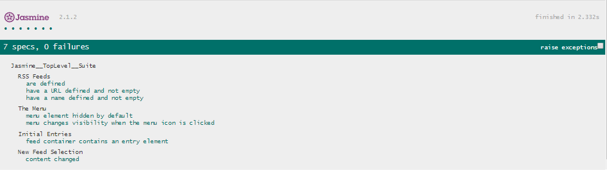

# Feed Reader Testing with Jasmine Project

The Feed Reader Testing with Jasmine Project is the 6th project of the Udacity Front End Nanodegree Progam. It is a single
page Rss Feeder application that uses Jasmine, a javascript testing framework, to test its functionality. The purpose 
of this project is to write code that functions and is testable.

## About Jasmine

[Jasmine](https://jasmine.github.io/) is a Behavior Driven Development (BDD) testing framework for JavaScript. It does not rely on any browsers, DOM, 
or JavaScript frameworks. Therefore, it’s suited for websites, Node.js projects, or anywhere JavaScript can run on. 
It also has runners in Python and Ruby, which  can assist you incredibly if you want to run your client-side tests 
alongside your server-side ones.

## Instructions

How to run this application locally:

1. Clone the repo or download the zip file.
1. Open the 'index.html' file in your browser.
1. Tests can be seen at the bottom.
1. To add or modify tests, use the 'feedreader.js' file.

OR

1. Open the [application](https://avnikolaou.github.io/Feed-Reader-Testing-with-Jasmine/) into your browser.
1. Scroll down to the bottom of the page and verify that the Jasmine framework was loaded correctly and tests actually
took place. 
1. Click on a feed to read it.
1. Load new feeds using the menu icon located on the top left corner.

In all cases, the tests should complete successfully without issues.